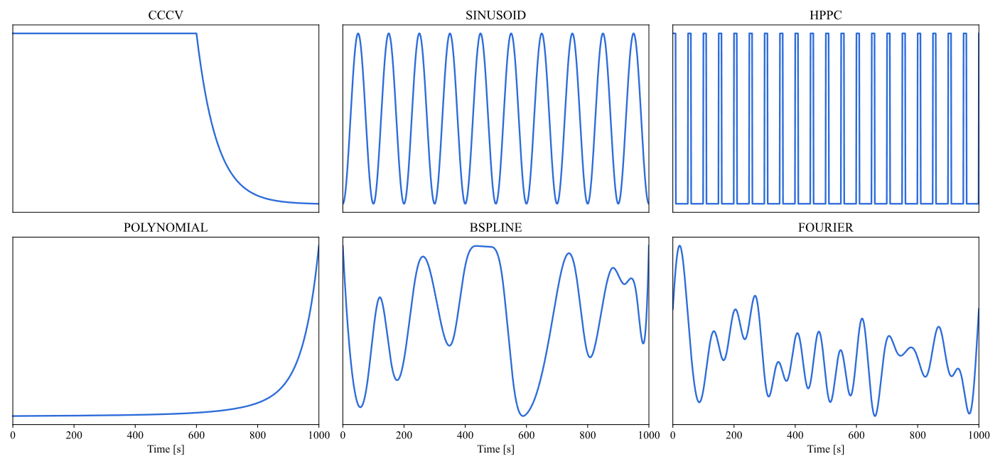

  

# Information-Theoretic Approach to Optimal Experimental Design of Current Profiles for Accurate Battery Parameter Estimation

  

## 1. Main Idea

### Background
- Increasing adoption of physics-based electrochemical models requires **accurate parameter estimation**.  
- Previous studies mainly focused on improving parameter estimator algorithms.  
- However, **the impact of current profile design** on estimation performance has been largely overlooked.  
- Model parameter identifiability is governed by the applied current profile.  

**[Effect of Current Profiles on Parameter Estimation Performance]**  

  
   
  <em>Figure. Current profiles</em>

**[Parameter Estimation Performance under Identical Estimator]**  

  
   
  <em>Table. Parameter Estimation Performance under Identical Estimator</em>

**[Limitation of Current Design Methods]**

   
  <em>Table. Comparison of Current Design Methods</em>

### Objective
1. Develop a flexible current design framework with high design freedom.  
2. Design optimized current profiles that maximize parameter identifiability.

## 2. Method

### Simulation Configuration
- **Model**: Doyle–Fuller–Newman (DFN)  
- **Target Battery**: NMC  
- **Target Parameters**: 16 parameters in DFN

### Method 1. Flexible Framework for Current Profile Design
To ensure **diversity** in current profiles, multiple basis functions such as **B-spline, Fourier, and Polynomial** were employed. Each basis provides distinct characteristics—smoothness, periodicity, or nonlinearity—and they allow the generation of a wide range of current waveforms without structural constraints. This approach enlarges the design space compared to conventional current design methods, thereby enhancing the potential for optimal current design. 

The generated current profile $I(t;\alpha)$ is formulated as a weighted combination of basis functions, where $\alpha$  controls the shape and $\phi(t)$  denotes the basis functions.

**Basis Function Characteristics**

Different basis functions exhibit distinct properties in terms of **smoothness, periodicity, and nonlinearity,** enabling the generation of diverse current profiles for analysis and experimentation.

| Basis      | Description                    | Characteristics                   |
|------------|--------------------------------|-----------------------------------|
| B-spline   | Smooth, locally controllable   | Nonlinear, continuous, curved     |
| Polynomial | Simple global representation   | Linear or highly curved profiles  |
| Fourier    | Periodic representation        | Repeated, oscillatory currents    |

### Method 2. Optimized Current Profiles for Maximizing Parameter Identifiability
Parameter identifiability was quantified using Global Sensitivity Analysis (GSA). Based on the GSA results, parameters were **grouped**, and optimized currents were **designed for each group** to maximize identifiability.

**Parameter Identifiability Analysis using GSA**
- Quantified by **Global Sensitivity Analysis (GSA)**  
- Parameter contributions to the output voltage V(t) were quantified as a measure of identifiability.
- 10,000 samples were drawn from the parameter space, and GSA was performed.
- These indices reveal which parameters are well identified by the applied current profiles.
- Indices:
  - **First-order index ( $S_i$ )**
    - Measures **main effect** of input $X_i$.
    - Fraction of output variance explained by $X_i$ alone.

$$
S_i = \frac{\mathrm{Var}_{X_i}\big( \mathbb{E}_{X_{\sim i}}(Y|X_i) \big)}{\mathrm{Var}(Y)}
$$

  - **Total-order index ( $S_{Ti}$ )**
      - Captures **all effects** of $X_i$ : main + interactions.
      - Measures how much variance remains if $X_i$ is fixed.

$$
S_{Ti} = 1 - \frac{\mathrm{Var}_{X_{\sim i}}\big( \mathbb{E}(Y|X_{\sim i}) \big)}{\mathrm{Var}(Y)} 
       = \frac{\mathbb{E}_{X_{\sim i}}\big( \mathrm{Var}(Y|X_{\sim i}) \big)}{\mathrm{Var}(Y)}
$$

Notation
- $Y$: Model output (e.g., voltage)
- $X = (X_1, X_2, \dots, X_p)$: Vector of input variables (model parameters)
- $X_i$: The i-th input variable under investigation
- $X_{\sim i}$: All input variables except $X_i$

[More Info about GSA?](https://butter00.tistory.com/manage/newpost/97?type=post&returnURL=ENTRY)

**Parameter Grouping**

- Parameters with strong interactions were separated into different groups to **ensure estimation stability.**
- This separation allows higher identifiability by separating parameters that interfere with each other.
- **Spectral clustering** was used for grouping, followed by Gram–Schmidt orthogonalization to validate independence. All orthogonalization values were **below 0.4**, ensuring independence among parameters within each group.

**Group-wise Current Optimization**

- Current profiles were optimized to **maximize parameter identifiability within each group**.
- Metaheuristic algorithms (e.g., Particle Swarm Optimization) were employed for the optimization.
- The result was **informative current profiles** that maximize parameter identifiability.

## 3. Experimental Evaluation

### Parameter Estimation (Group 1)

- Performance comparison under different current profiles:
    - **Baseline**: CC-CV, Sinusoid, HPPC
    - **Proposed method**: Generated currents (B-spline, Fourier, Polynomial)

**Optimal Designed Currents**

Each current profile was generated within the range of –1C - 1C over a duration of 1000 seconds. Using the proposed methodology, current profiles based on polynomial, B-spline, and Fourier basis functions were formulated. These currents were optimized to maximize the Global Sensitivity Analysis (GSA) of group1 parameters, thereby enhancing parameter identifiability.

**Parameter Estimation Performance**

The experimental results show that the proposed **polynomial-based current profile achieved the lowest voltage RMSE**, indicating the most accurate parameter estimation. The second-best performance was obtained with the CCCV profile. As illustrated in the figure, both profiles exhibit relatively smooth shapes with limited fluctuations. This suggests that Group 1 parameters (particle radius, diffusivity, and volume fraction) are best estimated under current profiles with minimal variations.

**Result Anaylsis**

- **Group 1 parameter characteristics**
    - Parameters such as particle radius, diffusivity, and volume fraction reflect structural and material properties.
    - These properties are more evident during slow, quasi-equilibrium processes rather than under strongly dynamic conditions.
- **Noise and signal stability**
    - Rapidly varying currents amplify noise and secondary effects (e.g., concentration gradients, thermal influences).
    - Flat currents reduce these disturbances, allowing parameter effects to appear more clearly in the voltage response.
- **Identifiability**
    - Highly dynamic currents mix the influence of multiple parameters, increasing correlation and reducing identifiability.
    - Smooth profiles simplify the system response, making individual parameter contributions more distinguishable.
 
## 4. Conclusions

This study proposes a **sensitivity-driven current design framework** for parameter estimation in electrochemical models. By applying Global Sensitivity Analysis (GSA), parameters were grouped and optimized currents were designed for each group.

The results show that Group1 parameters are more accurately estimated under smooth currents such as CC-CV and polynomial profiles. In particular, the polynomial current alleviates parameter correlation, leading to improved estimation performance. Overall, the proposed **information-theoretic based optimal current design** significantly enhances estimation performance compared to conventional current profiles, enabling **efficient and reliable parameter estimation**.

**Future Work**

- **Consider Temperature conditions**: Incorporate sensitivity and identifiability changes under varying thermal environments to ensure robust estimation in practical settings.
- **Extend Aging parameters**: Extend the framework to degradation-related parameters (e.g., SEI growth) for lifetime prediction.
- **Experimental validation**: Validate the proposed method with experimental data from commercial cells.
  

